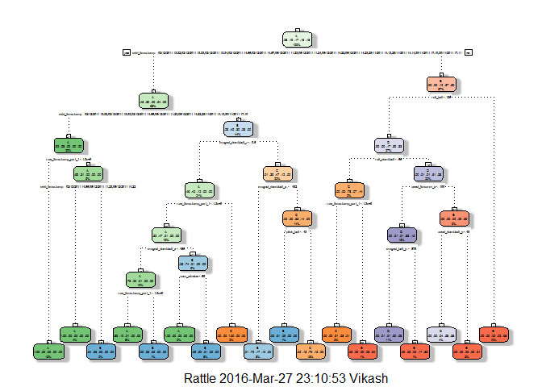
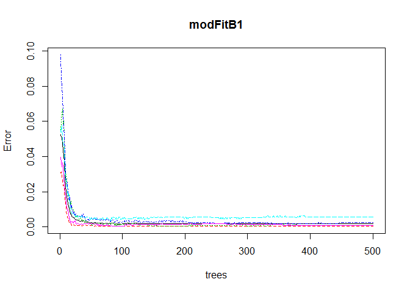

# Coursera_Machine_Learning_Assignment
Vikash  
March 27, 2016  
Project Introduction
Background

Using devices such as Jawbone Up, Nike FuelBand, and Fitbit it is now possible to collect a large amount of data about personal activity relatively inexpensively. These type of devices are part of the quantified self movement - a group of enthusiasts who take measurements about themselves regularly to improve their health, to find patterns in their behavior, or because they are tech geeks. One thing that people regularly do is quantify how much of a particular activity they do, but they rarely quantify how well they do it. In this project, your goal will be to use data from accelerometers on the belt, forearm, arm, and dumbell of 6 participants. They were asked to perform barbell lifts correctly and incorrectly in 5 different ways. More information is available from the website here: http://groupware.les.inf.puc-rio.br/har (see the section on the Weight Lifting Exercise Dataset).

Data

The training data for this project are available here: https://d396qusza40orc.cloudfront.net/predmachlearn/pml-training.csv

The test data are available here: https://d396qusza40orc.cloudfront.net/predmachlearn/pml-testing.csv

The data for this project come from this source: http://groupware.les.inf.puc-rio.br/har. If you use the document you create for this class for any purpose please cite them as they have been very generous in allowing their data to be used for this kind of assignment.

Goal

The goal of your project is to predict the manner in which they did the exercise. This is the “classe” variable in the training set. You may use any of the other variables to predict with. You should create a report describing how you built your model, how you used cross validation, what you think the expected out of sample error is, and why you made the choices you did. You will also use your prediction model to predict 20 different test cases.

Loading Packages

```r
library(caret)
```

```
## Warning: package 'caret' was built under R version 3.2.4
```

```
## Loading required package: lattice
```

```
## Loading required package: ggplot2
```

```
## Warning: package 'ggplot2' was built under R version 3.2.1
```

```r
library(rpart)
library(rpart.plot)
```

```
## Warning: package 'rpart.plot' was built under R version 3.2.3
```

```r
library(RColorBrewer)
```

```
## Warning: package 'RColorBrewer' was built under R version 3.2.1
```

```r
library(rattle)
```

```
## Warning: package 'rattle' was built under R version 3.2.3
```

```
## Rattle: A free graphical interface for data mining with R.
## Version 4.1.0 Copyright (c) 2006-2015 Togaware Pty Ltd.
## Type 'rattle()' to shake, rattle, and roll your data.
```

```r
library(randomForest)
```

```
## Warning: package 'randomForest' was built under R version 3.2.4
```

```
## randomForest 4.6-12
```

```
## Type rfNews() to see new features/changes/bug fixes.
```

```r
library(knitr)
```

```
## Warning: package 'knitr' was built under R version 3.2.3
```

Getting and loading the data


```r
set.seed(13360)
trainUrl <- "http://d396qusza40orc.cloudfront.net/predmachlearn/pml-training.csv"
testUrl <- "http://d396qusza40orc.cloudfront.net/predmachlearn/pml-testing.csv"
training <- read.csv(url(trainUrl), na.strings=c("NA","#DIV/0!",""))
testing <- read.csv(url(testUrl), na.strings=c("NA","#DIV/0!",""))
```

Partioning the training set into two

```r
inTrain <- createDataPartition(training$classe, p=0.6, list=FALSE)
myTraining <- training[inTrain, ]
myTesting <- training[-inTrain, ]
dim(myTraining); dim(myTesting)
```

```
## [1] 11776   160
```

```
## [1] 7846  160
```

Cleaning the data

Remove NearZeroVariance variables


```r
nzv <- nearZeroVar(myTraining, saveMetrics=TRUE)
myTraining <- myTraining[,nzv$nzv==FALSE]

nzv<- nearZeroVar(myTesting,saveMetrics=TRUE)
myTesting <- myTesting[,nzv$nzv==FALSE]
```

Transformation 3: Removing Variables with Sequence number and too many NAs. For Variables that have more than a 70% threshold of NA’s I’m going to leave them out:


```r
myTraining <- myTraining[c(-1)]
trainingV3 <- myTraining
for(i in 1:length(myTraining)) {
    if( sum( is.na( myTraining[, i] ) ) /nrow(myTraining) >= .7) {
        for(j in 1:length(trainingV3)) {
            if( length( grep(names(myTraining[i]), names(trainingV3)[j]) ) == 1)  {
                trainingV3 <- trainingV3[ , -j]
            }   
        } 
    }
}
myTraining <- trainingV3
rm(trainingV3)
```
Transform testing datasets as per Training sets

```r
clean1 <- colnames(myTraining)
clean2 <- colnames(myTraining[, -58])  # remove the classe column
myTesting <- myTesting[clean1]         # allow only variables in myTesting that are also in myTraining
testing <- testing[clean2]             # allow only variables in testing that are also in myTraining
dim(myTesting)
```

```
## [1] 7846   58
```
Making Training and Testing data sets to be the same

```r
for (i in 1:length(testing) ) {
    for(j in 1:length(myTraining)) {
        if( length( grep(names(myTraining[i]), names(testing)[j]) ) == 1)  {
            class(testing[j]) <- class(myTraining[i])
        }      
    }      
}

# To get the same class between testing and myTraining
testing <- rbind(myTraining[2, -58] , testing)
testing <- testing[-1,]
```

Prediction with Decision Trees


```r
set.seed(12345)
modFitA1 <- rpart(classe ~ ., data=myTraining, method="class")
fancyRpartPlot(modFitA1)
```

<!-- -->

```r
predictionsA1 <- predict(modFitA1, myTesting, type = "class")
cmtree <- confusionMatrix(predictionsA1, myTesting$classe)
cmtree
```

```
## Confusion Matrix and Statistics
## 
##           Reference
## Prediction    A    B    C    D    E
##          A 2163   64   11    2    0
##          B   54 1295  123   72    0
##          C   15  149 1208  207    2
##          D    0   10   25  941  160
##          E    0    0    1   64 1280
## 
## Overall Statistics
##                                           
##                Accuracy : 0.8778          
##                  95% CI : (0.8703, 0.8849)
##     No Information Rate : 0.2845          
##     P-Value [Acc > NIR] : < 2.2e-16       
##                                           
##                   Kappa : 0.8453          
##  Mcnemar's Test P-Value : NA              
## 
## Statistics by Class:
## 
##                      Class: A Class: B Class: C Class: D Class: E
## Sensitivity            0.9691   0.8531   0.8830   0.7317   0.8877
## Specificity            0.9863   0.9607   0.9424   0.9703   0.9899
## Pos Pred Value         0.9656   0.8387   0.7641   0.8283   0.9517
## Neg Pred Value         0.9877   0.9646   0.9745   0.9486   0.9751
## Prevalence             0.2845   0.1935   0.1744   0.1639   0.1838
## Detection Rate         0.2757   0.1651   0.1540   0.1199   0.1631
## Detection Prevalence   0.2855   0.1968   0.2015   0.1448   0.1714
## Balanced Accuracy      0.9777   0.9069   0.9127   0.8510   0.9388
```

Prediction with Random Forests


```r
set.seed(12345)
modFitB1 <- randomForest(classe ~ ., data=myTraining)
predictionB1 <- predict(modFitB1, myTesting, type = "class")
cmrf <- confusionMatrix(predictionB1, myTesting$classe)
cmrf
```

```
## Confusion Matrix and Statistics
## 
##           Reference
## Prediction    A    B    C    D    E
##          A 2232    4    0    0    0
##          B    0 1514    5    0    0
##          C    0    0 1362    2    0
##          D    0    0    1 1284    2
##          E    0    0    0    0 1440
## 
## Overall Statistics
##                                         
##                Accuracy : 0.9982        
##                  95% CI : (0.997, 0.999)
##     No Information Rate : 0.2845        
##     P-Value [Acc > NIR] : < 2.2e-16     
##                                         
##                   Kappa : 0.9977        
##  Mcnemar's Test P-Value : NA            
## 
## Statistics by Class:
## 
##                      Class: A Class: B Class: C Class: D Class: E
## Sensitivity            1.0000   0.9974   0.9956   0.9984   0.9986
## Specificity            0.9993   0.9992   0.9997   0.9995   1.0000
## Pos Pred Value         0.9982   0.9967   0.9985   0.9977   1.0000
## Neg Pred Value         1.0000   0.9994   0.9991   0.9997   0.9997
## Prevalence             0.2845   0.1935   0.1744   0.1639   0.1838
## Detection Rate         0.2845   0.1930   0.1736   0.1637   0.1835
## Detection Prevalence   0.2850   0.1936   0.1738   0.1640   0.1835
## Balanced Accuracy      0.9996   0.9983   0.9977   0.9990   0.9993
```

```r
plot(modFitB1)
```

<!-- -->

Prediction with Generalized Boosted Regression


```r
set.seed(12345)
fitControl <- trainControl(method = "repeatedcv",
                           number = 5,
                           repeats = 1)

gbmFit1 <- train(classe ~ ., data=myTraining, method = "gbm",
                 trControl = fitControl,
                 verbose = FALSE)
```

```
## Loading required package: gbm
```

```
## Warning: package 'gbm' was built under R version 3.2.4
```

```
## Loading required package: survival
```

```
## 
## Attaching package: 'survival'
```

```
## The following object is masked from 'package:caret':
## 
##     cluster
```

```
## Loading required package: splines
```

```
## Loading required package: parallel
```

```
## Loaded gbm 2.1.1
```

```
## Loading required package: plyr
```

```
## Warning: package 'plyr' was built under R version 3.2.1
```

```r
gbmFinMod1 <- gbmFit1$finalModel
gbmPredTest <- predict(gbmFit1, newdata=myTesting)
gbmAccuracyTest <- confusionMatrix(gbmPredTest, myTesting$classe)
gbmAccuracyTest
```

```
## Confusion Matrix and Statistics
## 
##           Reference
## Prediction    A    B    C    D    E
##          A 2232    7    0    0    0
##          B    0 1505    0    0    0
##          C    0    5 1361    0    0
##          D    0    1    7 1285    3
##          E    0    0    0    1 1439
## 
## Overall Statistics
##                                          
##                Accuracy : 0.9969         
##                  95% CI : (0.9955, 0.998)
##     No Information Rate : 0.2845         
##     P-Value [Acc > NIR] : < 2.2e-16      
##                                          
##                   Kappa : 0.9961         
##  Mcnemar's Test P-Value : NA             
## 
## Statistics by Class:
## 
##                      Class: A Class: B Class: C Class: D Class: E
## Sensitivity            1.0000   0.9914   0.9949   0.9992   0.9979
## Specificity            0.9988   1.0000   0.9992   0.9983   0.9998
## Pos Pred Value         0.9969   1.0000   0.9963   0.9915   0.9993
## Neg Pred Value         1.0000   0.9979   0.9989   0.9998   0.9995
## Prevalence             0.2845   0.1935   0.1744   0.1639   0.1838
## Detection Rate         0.2845   0.1918   0.1735   0.1638   0.1834
## Detection Prevalence   0.2854   0.1918   0.1741   0.1652   0.1835
## Balanced Accuracy      0.9994   0.9957   0.9971   0.9988   0.9989
```

Predicting Results on the Test Data

Random Forests gave an Accuracy in the myTesting dataset of 99.89%, which was more accurate that what I got from the Decision Trees or GBM. The expected out-of-sample error is 100-99.89 = 0.11%.


```r
predictionB2 <- predict(modFitB1, testing, type = "class")
predictionB2
```

```
##  2 31  4  5  6  7  8  9 10 11 12 13 14 15 16 17 18 19 20 21 
##  B  A  B  A  A  E  D  B  A  A  B  C  B  A  E  E  A  B  B  B 
## Levels: A B C D E
```

# Write the results to a text file for submission

```r
pml_write_files = function(x){
    n = length(x)
    for(i in 1:n){
        filename = paste0("problem_id_",i,".txt")
        write.table(x[i],file=filename,quote=FALSE,row.names=FALSE,col.names=FALSE)
    }
}
```

